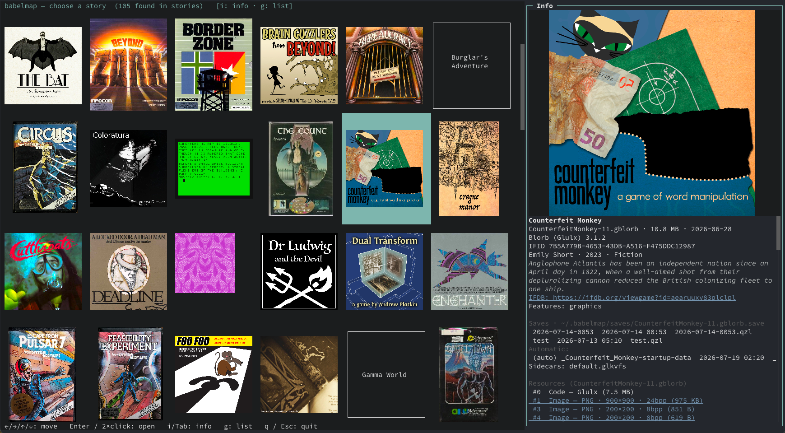
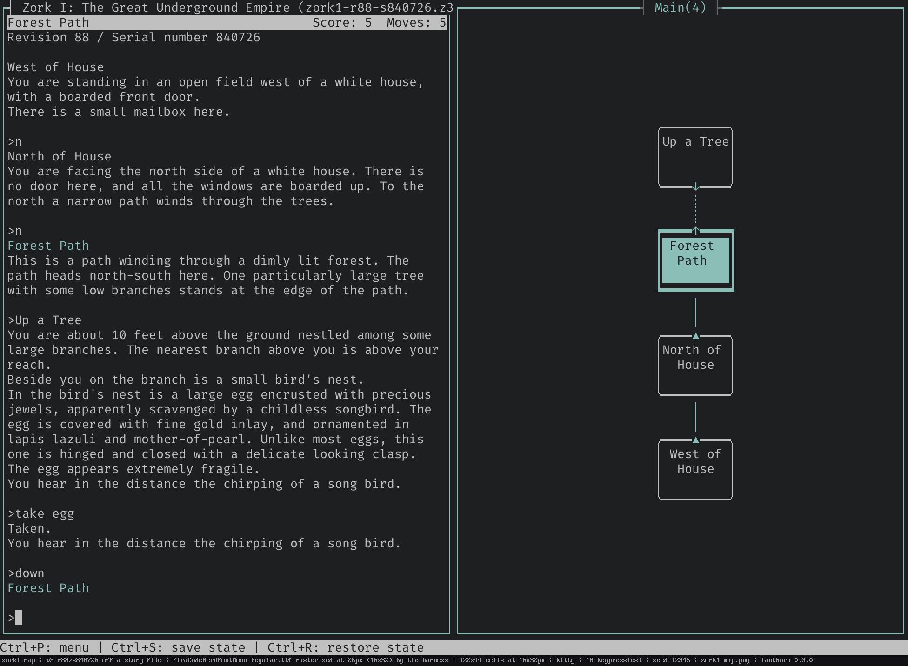
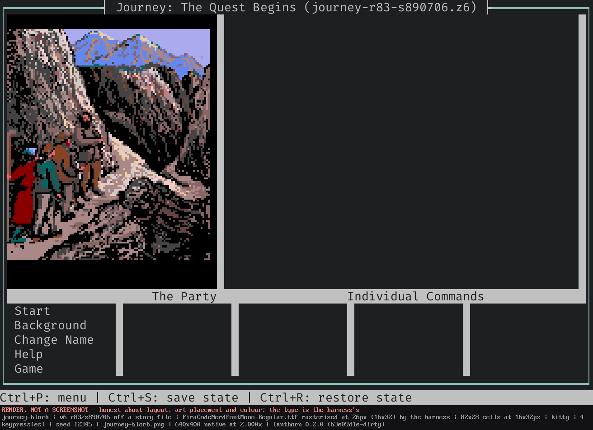
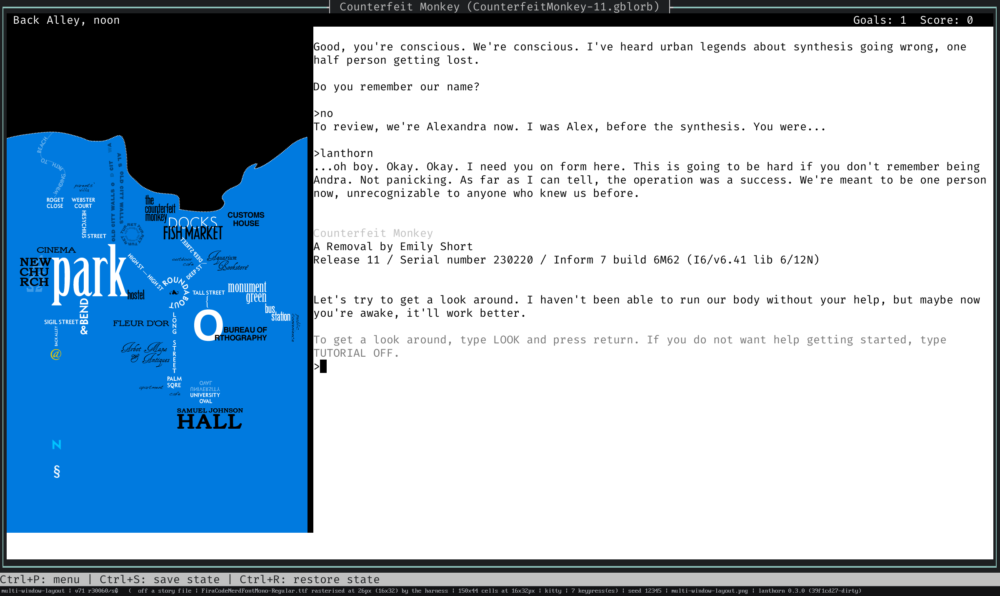
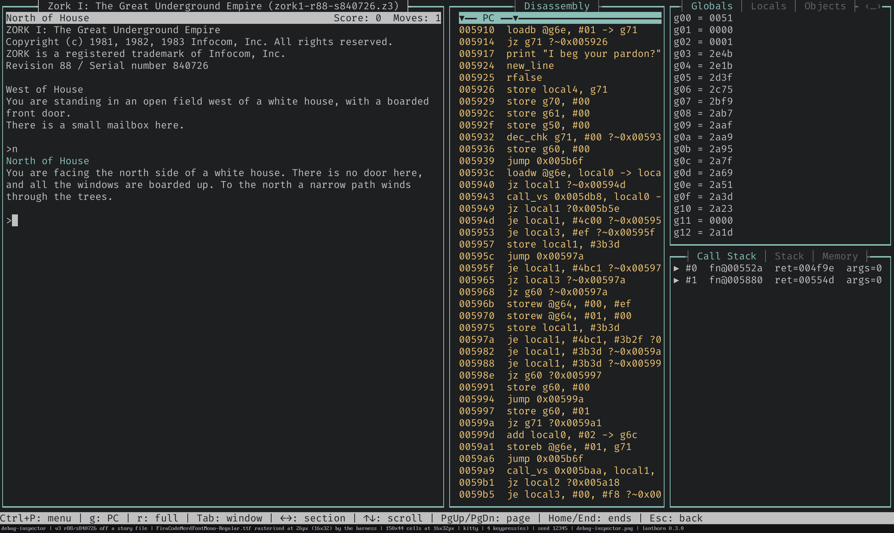
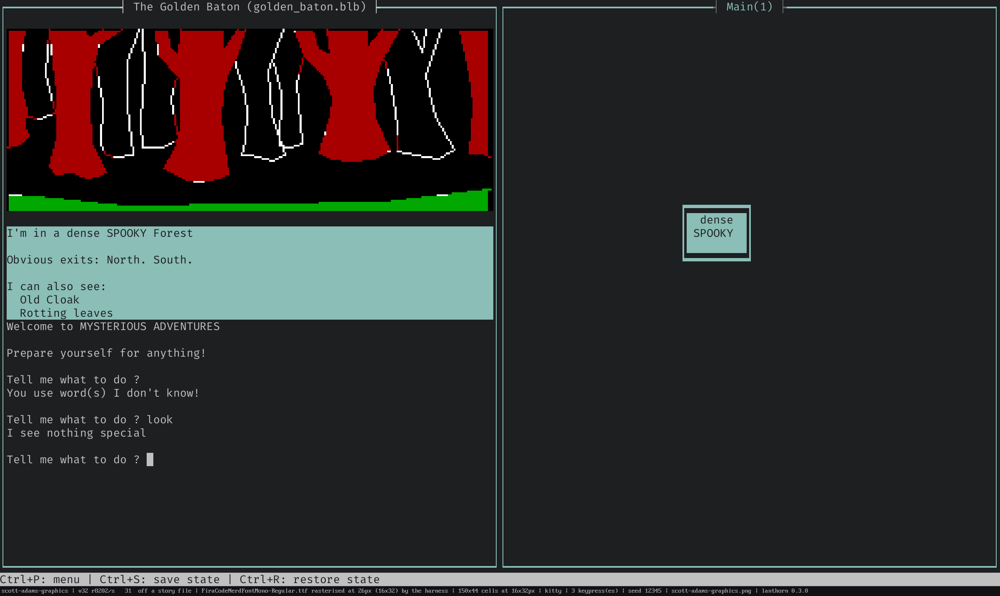
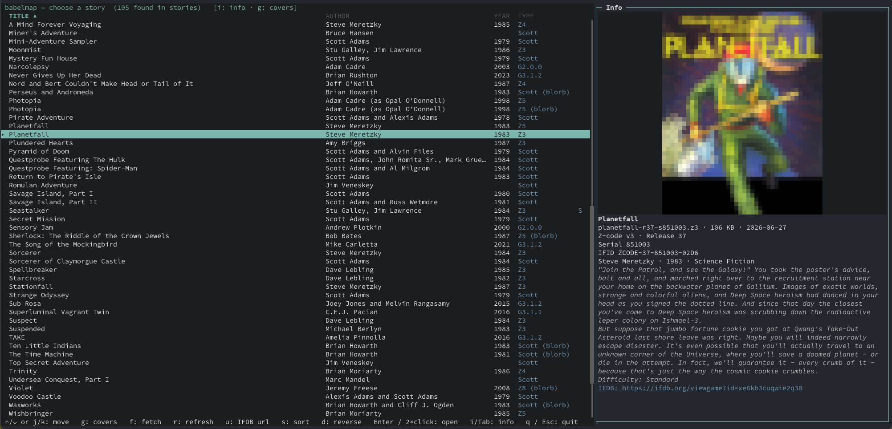

# babelmap

[](https://github.com/sharkusk/babelmap/actions/workflows/test.yml)
[](https://github.com/sharkusk/side-quest)

**Play interactive fiction in your terminal while babelmap draws the map for you — live, as you explore.**

babelmap is a terminal interactive-fiction interpreter with a built-in
*automapper*. Point it at a story — the Infocom canon and Z-machine classics
like *Zork*, modern Inform 7 / Glulx games, graphical *Zork Zero*, or a classic
Scott Adams text adventure — play it in a clean, mouse-driven TUI, and watch a
room-and-connection map assemble itself from your movements. No graph paper, no
manual annotation: every room you enter and every exit you take is placed,
routed, and de-overlapped automatically, then continuously tidied into a
readable layout. Three from-scratch, zero-dependency virtual machines under one
roof; one engine-agnostic mapper that charts them all.

> **Beta software.** babelmap is cutting its first public beta. The formats that
> live on your disk between sessions — saves, the `.babelmap` archive, the
> sidecars — are now **frozen and version-pinned**, so a future change can't
> silently corrupt them (see the [save-format policy](docs/release/save-format-policy.md)).
> The `config.toml` / `style.toml` schemas stay tolerant but may still gain
> fields. Expect rough edges; report the sharp ones.

---

## See it

<!-- DEMO: drop a terminal-recording GIF/VHS cast of a play-through + live map here -->
<!-- e.g.  -->





<details>
<summary>More screenshots</summary>

<!-- SCREENSHOTS: additional stills / GIFs can be dropped in below -->











</details>

---

## Quick start

babelmap builds with a Rust toolchain. On Linux, the default `playback` audio
feature needs ALSA headers: `libasound2-dev` (Debian/Ubuntu) or `alsa-lib-devel`
(Fedora).

```bash
# Build
cargo build --release

# Play a story
./target/release/babelmap path/to/story.z5

# Point it at a directory to open the story picker instead
./target/release/babelmap ~/if-games/
```

Don't have a story yet? Launch the picker and press **`/`** to browse IFDB's
popular list or search by title/author, then **download a playable story file
straight into your library** — babelmap grabs it in the background and drops you
right on it.

Set a `default_story_dir` (babelmap offers to remember the first directory you
open) and a bare **`babelmap`** opens your library there. You type at the
story's own inline `>` prompt, the way a classic terminal interpreter works;
press the leader key (default **`Ctrl+P`**) for a pop-up reference of every
command.

Supported formats: **Z-machine v3–v8** (incl. graphical v6), **Glulx**, and
**Scott Adams** (ScottFree `.dat`) — auto-detected from the file, loaded raw,
from a `.zip`, or from a **Blorb** container (`.zblorb`/`.blorb`/`.gblorb`).
(v1/v2 are not supported.)

---

## Highlights

- **Three engines, one player** — a clean-room **Z-machine** (v3–v8, incl.
  graphical v6), **Glulx** (Inform 7, with an accelerated veneer and full Glk
  0.7.6), and **Scott Adams** (ScottFree), auto-detected from the file. Pure
  Rust, no C bindings, zero runtime deps. → [interpreter](docs/features/interpreter.md)
- **Live automapping** — rooms and connections placed, routed, and de-overlapped
  as you explore, split across switchable multi-level **layers**, and
  continuously re-tidied. Engine-agnostic: the same map grows for *Zork*,
  *Counterfeit Monkey*, or *Adventureland*. → [mapping](docs/features/mapping.md)
- **Graphical Z-machine v6** — *Zork Zero*'s full illustrated frame (banner,
  columns, per-room compass, illuminated drop-caps) rendered faithfully at an
  authentic 640×400 with a `hybrid` / `raster` / `frameless` render choice.
  → [v6 graphics](docs/features/v6-graphics.md)
- **Pictures in your terminal** — cover art, in-game Glulx graphics windows, and
  inline images render with your terminal's best protocol (Kitty / iTerm2 /
  Sixel) and a universal half-block fallback. → [interface](docs/features/interface.md)
- **Built-in debug inspector** — `/debug` turns the map pane into a live
  disassembler with PC tracking, opcode hover help, and click-to-jump operands —
  retargeted per engine (Z-machine registers, Glulx routine discovery, Scott
  Adams' action table). → [interface](docs/features/interface.md)
- **A full TUI** — mouse support, select-and-copy (over SSH via OSC 52), a
  verb/noun menu, dictionary autocomplete, a `/`-summoned fuzzy **command
  palette**, an inventory strip, command history, notification toasts, and
  transcript search / filter / export. → [interface](docs/features/interface.md)
- **Story picker & IFDB** — browse a library as a badged **list** or `g`
  cover-gallery **grid**, with a live metadata info panel, on-demand IFDB fetch
  cached per game, and `/` **IFDB search + download** into your library.
  → [interface](docs/features/interface.md)
- **In-game hints** — open a matching *InvisiClues* file and babelmap boots it in
  a second Z-machine over the story pane; ~50 Infocom titles can fetch one on
  demand with `H`. → [interface](docs/features/interface.md)
- **Sound & colour** — Z-machine bleeps + Blorb sampled audio and Glulx Glk sound
  channels (AIFF/Ogg/MOD, per-channel volume), plus game-driven `set_colour` /
  Glk style hints honored at 24-bit RGB. → [interpreter](docs/features/interpreter.md) · [remote audio](docs/remote-sound.md)
- **Saves & rewind** — self-contained `.babelmap` Save States (map + VM + screen
  + transcript), named slots, standard Quetzal import/export, auto-save/load, and
  a per-turn **rewind/replay** history with the map reconstructed at each moment.
  → [saves](docs/features/saves.md) · [persistence model](docs/persistence.md)
- **Deeply themeable** — a 7-role palette the whole UI derives from, first-class
  styling for all 11 Glk styles, per-game looks, a templated status bar, and a
  fully configurable keymap in an auto-seeded, live-reloadable `style.toml`.
  → [customization](docs/features/customization.md)
- **Crash-proof** — a faulting story halts with a call-frame stack trace (saved
  to `~/.babelmap/crash.log`) while the app stays interactive, instead of taking
  the interpreter down. → [interpreter](docs/features/interpreter.md)

For the full, exhaustive feature list see **[`docs/features/`](docs/features/)**;
for the standards babelmap implements (Z-Machine, Glulx, Glk, Quetzal, Blorb,
Treaty of Babel) see **[`docs/standards.md`](docs/standards.md)**; for the crate
layout and I/O design see **[`docs/architecture.md`](docs/architecture.md)**.

---

## Terminal support

Cover art, in-game graphics, and v6's illustrated frame render with real pixels
wherever the terminal supports a graphics protocol — and babelmap auto-detects
which, so you rarely set anything. Full pixel graphics reach **all three OSes**:

| Graphics protocol | Terminals | Platforms |
|---|---|---|
| **Kitty graphics** | kitty, Ghostty, WezTerm | Linux · macOS · Windows |
| **iTerm2 inline images** | iTerm2 | macOS |
| **Sixel** | Windows Terminal **1.22+**, foot, xterm (+ others) | Windows 11 · Linux · macOS |
| *Unicode half-blocks* (automatic fallback) | any terminal, incl. SSH / tmux / plain | everywhere |

Anything without a pixel protocol — a remote session, a bare console — degrades
to the universal half-block renderer automatically, so a story always stays
playable and the map always draws. Sixel has the heaviest **encode** cost of the
three (the v6 `raster` mode leans on it hardest); babelmap encodes off the UI
thread so playing stays responsive, but on a very large pane Kitty or iTerm2 will
feel snappier. Force a specific path with
`--image-protocol <auto|halfblocks|kitty|sixel|iterm2>`, or turn image rendering
off entirely with `--no-images`.

---

## Configuration

babelmap reads `~/.babelmap/config.toml` (override with `--user-dir`, or point at
a file with `--config`); every setting has a default, so the file is optional.
CLI flags beat the config file, which beats built-in defaults. Saves and sidecars
live under `~/.babelmap/saves/<story-filename>.save/` by default; `--data-dir
<path>` relocates just those. See
[customization & configuration](docs/features/customization.md) and the
[persistence model](docs/persistence.md).

---

## Development

```bash
cargo build --workspace          # build everything
cargo test --workspace           # fast suite (a few slow tests are skipped)
cargo test --workspace -- --include-ignored  # everything, incl. slow full-game walkthroughs
cargo run -p zvm-cli   -- story.z5    # DOS-style CLI player (no map)
cargo run -p gvm-cli   -- story.ulx   # DOS-style Glulx CLI player (no map)
cargo run -p scott-cli -- story.dat   # DOS-style Scott Adams CLI player (no map)
```

The workspace is four shipped binaries — the mapping TUI (`babelmap`, in the
`app` crate) plus three no-map CLI players — over a set of library crates: the
three VMs (`zvm` / `gvm` / `scott`), the VM-agnostic `mapper`, and supporting
`blorb` / `audio` crates. CI runs the full suite on Linux, macOS, and Windows,
plus clippy, on every push and PR. A few slow full-game Glulx walkthroughs
(Kerkerkruip, Counterfeit Monkey) are marked `#[ignore]`; pass `--include-ignored`
to run them.

The `audio` crate carries two default-on features: `playback` (real output via
`rodio`) and `mod-music` (ProTracker `.mod` playback). Build with
`--no-default-features` for a compile-time no-op backend (headless/CI); with
`playback` on, a missing audio device degrades to silence rather than erroring.

Cut a release by pushing a version tag (`git tag v0.1.0-beta.1 && git push origin
v0.1.0-beta.1`) — the release workflow builds every platform and opens a draft
GitHub Release; a hyphenated suffix marks it a pre-release. See
[`CHANGELOG.md`](CHANGELOG.md) for what's in each release.

---

## License

babelmap is released under the **BSD 3-Clause License** — see [`LICENSE`](LICENSE).
