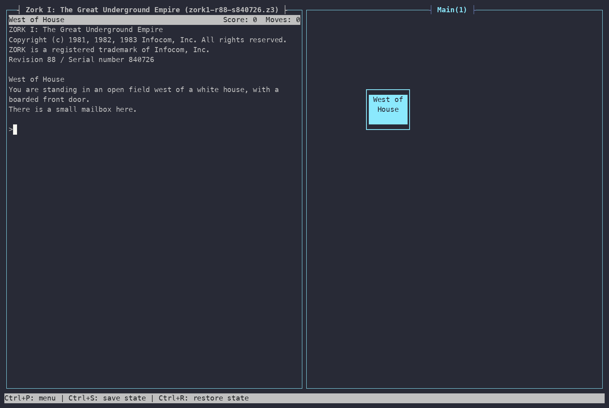
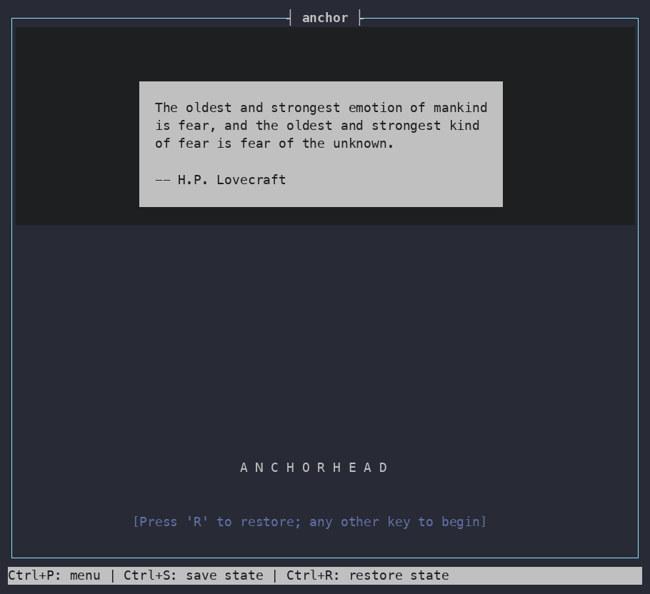
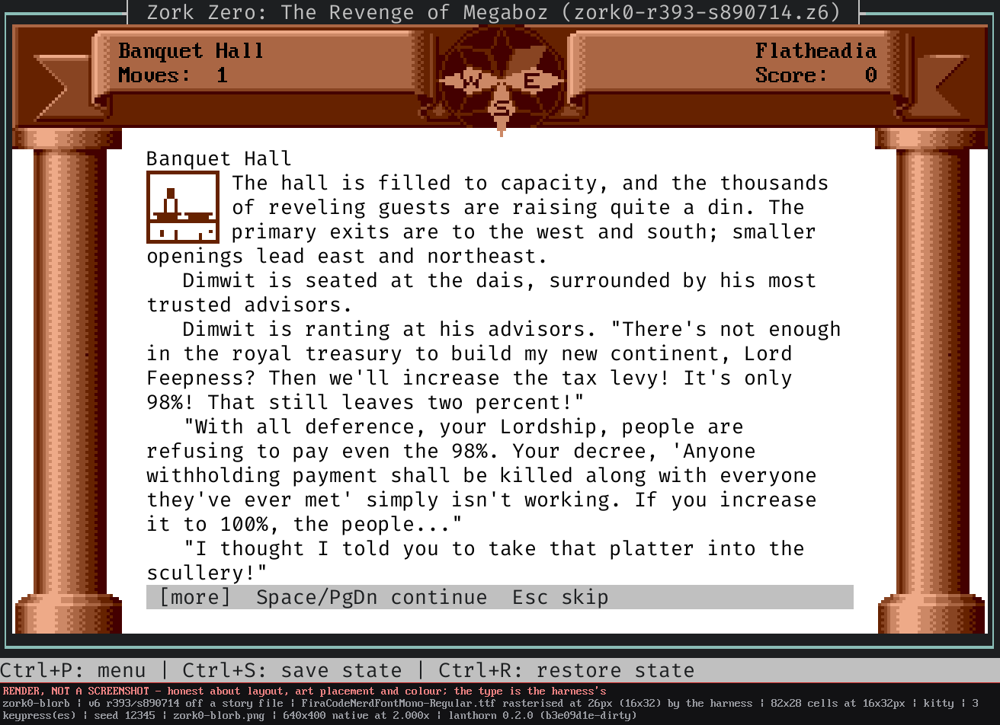
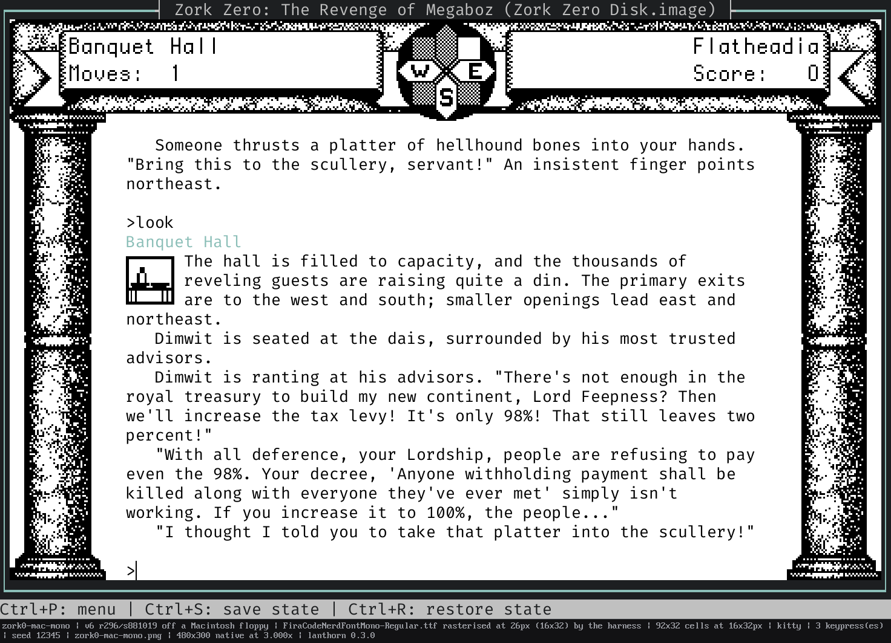
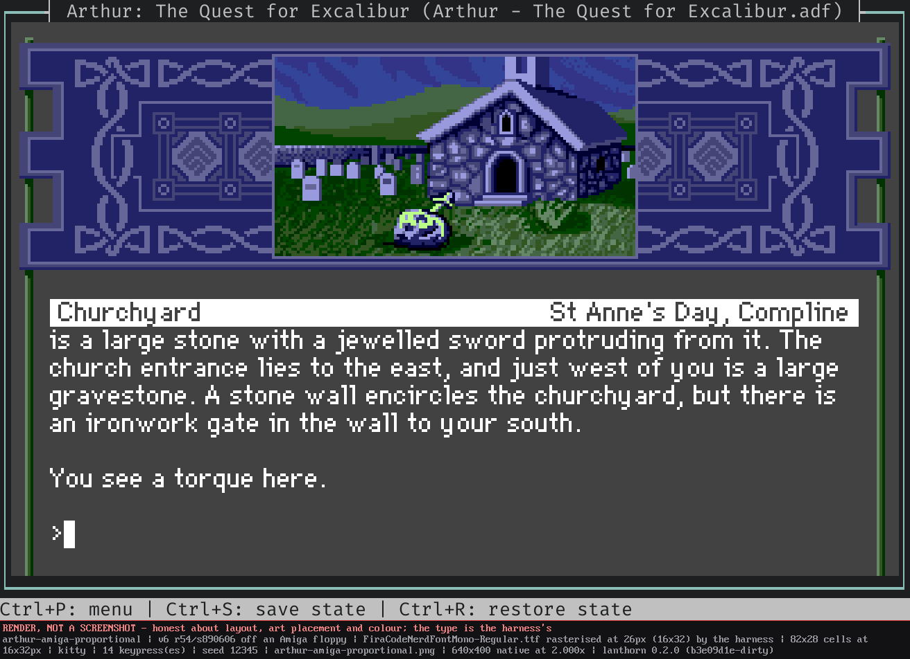
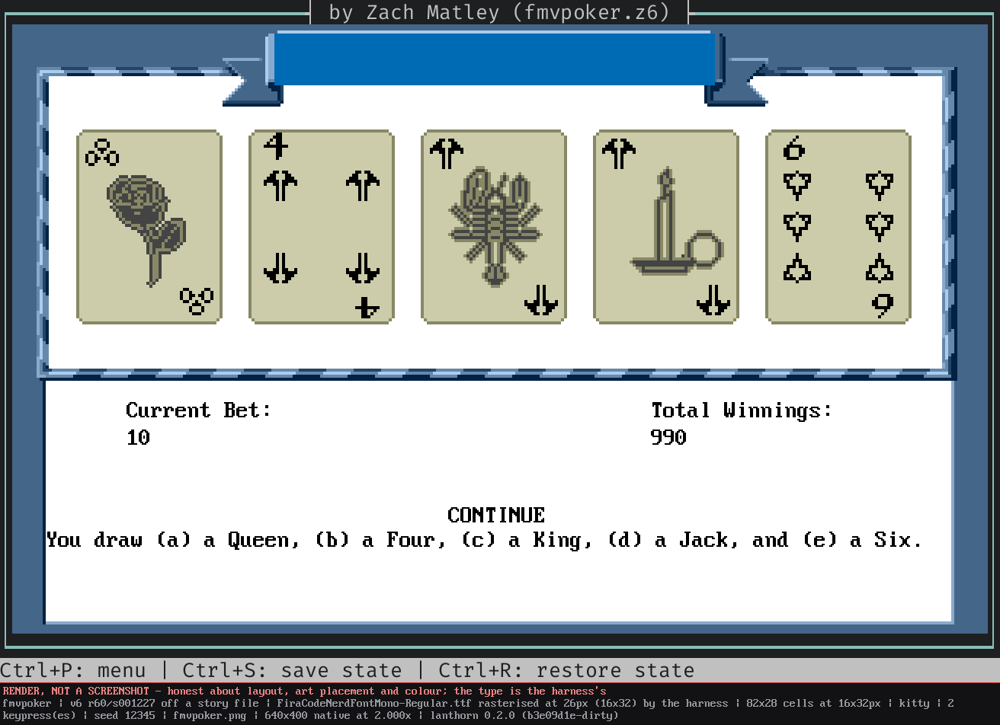
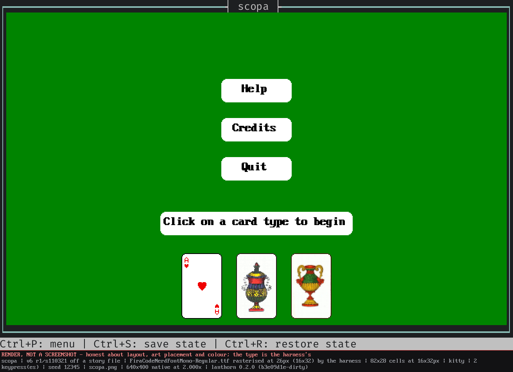

<p align="center">
  
</p>

[](https://github.com/sharkusk/lanthorn/actions/workflows/test.yml)
[](https://github.com/sharkusk/side-quest)

**Play interactive fiction in your terminal while lanthorn draws the map for you — live, as you explore.**

### Supported story formats:

* **Z-machine v3–v8** (incl. graphical v6)
* **Glulx**
* **Scott Adams**

### Supported original Infocom disk formats:

* Amiga
* Mac
* PC
* ST
* AppleII
* C-64/128

---

## See it

**The map draws itself while you play.** A lap of the white house in each
direction — nothing typed but the game's own commands, no annotation, no graph
paper.



**Your IF library at a glance.** The story list can be configured as a list of grid of covers. Press `[TAB]` to
bring up the story info panel.


<details>
<summary>More screenshots</summary>

<!-- SCREENSHOTS: additional stills / GIFs can be dropped in below -->

















</details>

---

## Quick start

Grab the archive for your platform from the
[**latest release**](https://github.com/sharkusk/lanthorn/releases) — Linux
(x86_64), macOS (universal), and Windows (x86_64) builds ship with every
release, four binaries in each: `lanthorn` itself plus the no-map CLI players
(`zvm-cli` / `gvm-cli` / `scott-cli`). Extract it and run:

```bash
# Play a story
./lanthorn path/to/story.z5

# Point it at a directory to open the story picker instead
./lanthorn ~/if-games/
```

---

## Launching it

**Open a library and pick from it**

```bash
lanthorn ~/if-games/                    # any directory — the story picker opens on it
```

Lanthorn offers to remember the first directory you open as the `default_story_dir`.
If you accept, a bare **`lanthorn`** uses that as your default directory.

The picker let's you browse all your stories, download cover art and meta data, plus
**`/`** to pull a new story down from IFDB without leaving it.

**Go straight into one game**

```bash
lanthorn stories/zork1.z3               # a bare story file
lanthorn Advent.zblorb                  # a Blorb — its art and sound come with it
lanthorn adventureland.dat              # a Scott Adams game
```

**Play it off the disk it shipped on**

```bash
lanthorn "Zork Zero.adf"                            # an Amiga floppy, presented as an Amiga
lanthorn "Zork Zero Disk.image"                     # a Macintosh floppy
lanthorn "LostTreasures1.iso" --story 3             # a compilation disc, by position…
lanthorn "InfocomMasterpieces.img" --story arthur   # …or by name
```

**Turn things off**

```bash
lanthorn stories/sherlock.z5 --no-sound          # quiet; the border still flashes as the cue
lanthorn stories/zork0.z6 --no-images            # skip the artwork; the prose still plays
lanthorn stories/zork0.z6 --image-protocol kitty # force a protocol instead of auto-detecting
```

---

## Feature Highlights

- **Three engines, one player** — a clean-room **Z-machine** (v3–v8, incl.
  graphical v6), **Glulx** (Inform 7, with an accelerated veneer and full Glk
  0.7.6), and **Scott Adams** (ScottFree), auto-detected from the file. Pure
  Rust, no C bindings, zero runtime deps. → [interpreter](docs/features/interpreter.md)
- **Live automapping** — rooms and connections placed, routed, and de-overlapped
  as you explore, split across switchable multi-level **layers**, and
  continuously re-tidied. Engine-agnostic: the same map grows for *Zork*,
  *Counterfeit Monkey*, or *Adventureland*. Click any room — on the map or in
  the **matrix** view — and lanthorn highlights the way there from where you
  stand; a docked **room panel** follows you with the current room's exits,
  contents and connections. → [mapping](docs/features/mapping.md)
- **Graphical Z-machine v6** — *Zork Zero*'s full illustrated frame (banner,
  columns, per-room compass, illuminated drop-caps) rendered faithfully at an
  authentic 640×400, with a `hybrid` / `raster` render choice. A terminal taller
  than the screen the game was drawn for is filled by *extending* the border out
  of its own artwork rather than stretching it — a banded column picks up more
  bands, at the spacing the artist drew them.
  → [v6 graphics](docs/features/v6-graphics.md)
- **Even the games that predate colour** — a v1–v4 story has no colour concept at
  all, so everything you see for one is the *interpreter's* presentation rather
  than anything the story asked for. Open *Zork I* off a Commodore disk or
  *Spellbreaker* off an Amiga floppy and lanthorn dresses the pane the way that
  machine's own interpreter dressed its screen: its page and ink, its status line
  and the shape of its cursor. Nine machines, every value measured off emulator
  captures of the release disks rather than guessed. → [interpreter](docs/features/interpreter.md)
- **The machine's own typeface, off the machine's own media** — Version 6 text is
  set in the face the original interpreter drew with, read from the media rather
  than bundled: *Arthur*'s proportional face off its Amiga floppy, stepped at the
  game's own per-glyph advances; Monaco out of a Macintosh resource fork; and,
  from boot media you supply, **Geneva** off a Mac OS System file and **topaz 8**
  out of a Kickstart ROM — the only place topaz 8 has ever existed. → [v6 graphics](docs/features/v6-graphics.md)
- **Play straight off the original release disks** — Amiga, Macintosh, Apple II,
  Atari ST, PC, Commodore and the *Lost Treasures* CDs, with the artwork and the
  sound each disk carries and the machine it came from. See
  [**Play the original disks**](#play-the-original-disks) below.
  → [interpreter](docs/features/interpreter.md)
- **Pictures in your terminal** — cover art, in-game Glulx graphics windows, and
  inline images render with your terminal's best protocol (Kitty / iTerm2 /
  Sixel) and a universal half-block fallback. → [interface](docs/features/interface.md)
- **Built-in debug inspector** — `/debug` turns the map pane into a live
  disassembler with PC tracking, opcode hover help, and click-to-jump operands —
  retargeted per engine (Z-machine registers, Glulx routine discovery, Scott
  Adams' action table). → [interface](docs/features/interface.md)
- **A full TUI** — mouse support, drag-to-resize panes, select-and-copy (over
  SSH via OSC 52), a Journey-style click-to-compose **command band**, dictionary
  autocomplete, a `/`-summoned fuzzy **command palette**, an inventory strip,
  command history, notification toasts, and transcript search / filter /
  export. → [interface](docs/features/interface.md)
- **Three lightweight CLI players** — `zvm-cli`, `gvm-cli` and `scott-cli` play
  any story in a bare terminal, with your scrollback intact and a screen-reader
  mode that emits zero escape sequences. See
  [**The command-line players**](#the-command-line-players) below.
  → [interpreter](docs/features/interpreter.md)
- **Story picker & IFDB** — browse a library as a badged **list** or `g`
  cover-gallery **grid**, with a live metadata info panel, on-demand IFDB fetch
  cached per game, and `/` **IFDB search + download** into your library.
  → [interface](docs/features/interface.md)
- **In-game hints** — open a matching *InvisiClues* file and lanthorn boots it in
  a second Z-machine over the story pane; ~50 Infocom titles can fetch one on
  demand with `H`. → [interface](docs/features/interface.md)
- **Sound & colour** — Z-machine bleeps + Blorb sampled audio and Glulx Glk sound
  channels (AIFF/Ogg/MOD, per-channel volume), plus game-driven `set_colour` /
  Glk style hints honored at 24-bit RGB. → [interpreter](docs/features/interpreter.md) · [remote audio](docs/remote-sound.md)
- **Saves & rewind** — self-contained `.lanthorn` saves (map + VM + screen +
  transcript) written by Ctrl+S *and* by the story's own `SAVE`, so an in-game
  restore brings your scrollback back too; named slots, standard Quetzal
  import/export, auto-save/load, and a per-turn **rewind/replay** history with the
  map reconstructed at each moment.
  → [saves](docs/features/saves.md) · [persistence model](docs/persistence.md)
- **Deeply themeable** — a 7-role palette the whole UI derives from, first-class
  styling for all 11 Glk styles, per-game looks, a templated status bar, and a
  fully configurable keymap in an auto-seeded, live-reloadable `style.toml`.
  → [customization](docs/features/customization.md)

For the full, exhaustive feature list see **[`docs/features/`](docs/features/)**;
for the standards lanthorn implements (Z-Machine, Glulx, Glk, Quetzal, Blorb,
Treaty of Babel) see **[`docs/standards.md`](docs/standards.md)**; for the crate
layout and I/O design see **[`docs/architecture.md`](docs/architecture.md)**.

---

## Play the original disks

Hand lanthorn a disk image and it mounts the filesystem, finds the story *and*
everything shipped beside it, and presents the machine that disk came from —
interpreter number, palette, default colours and screen rules together, so a
game that asks what it is running on gets one coherent answer.

```bash
lanthorn "Zork Zero.adf"                      # an Amiga floppy
lanthorn "Arthur.po"                          # an Apple II ProDOS volume
lanthorn "LostTreasures1.iso" --story 3       # a compilation CD
```

| Medium | Extensions | Presents as |
|---|---|---|
| AmigaDOS floppy | `.adf` | Amiga (4) |
| Macintosh HFS floppy, incl. DiskCopy 4.2 | `.image` `.dc42` `.toast` | Macintosh (3) |
| Apple II ProDOS volume | `.2mg` `.po` `.dsk` | Apple IIgs (10) |
| Apple II raw self-booting press | `.dsk` | Apple IIgs (10) |
| Atari ST floppy | `.st` | Atari ST (5) |
| Commodore 1541 | `.d64` | Commodore 128 (7) |
| PC floppy | `.ima` `.img` | — |
| CD-ROM, incl. hybrid Mac/PC discs | `.iso` `.bin` | Macintosh (3) or PC/DOS, per file |

**The artwork comes off the disk in the disk's own format** — Amiga, Apple II
(8-byte records, RLE and XOR), the PC archives (LZW and all), and the Macintosh
monochrome plate — rather than from a converted Blorb. EGA and CGA plates are
drawn in the colours their card fixed. Where a release offers more than one
rendition, a dialog, a flag and a key all reach the same choice.

**And the sound.** *The Lurking Horror* and *Sherlock* shipped sampled effects on
their release disks years before Blorb existed, in a format nothing else reads.
lanthorn plays them — off the Amiga floppies and off the Macintosh `/MAC/SOUND`
layout on the *Lost Treasures* CD — including the **pitch**. Each effect names a
note, each sample states the note it was recorded at, and the gap between the two
is the bend, so *Sherlock*'s heartbeat really does beat at three speeds from one
recording. That model was read out of the 68000 interpreter Infocom shipped
rather than inferred from the files.


*Arthur*'s Amiga floppy carries a real proportional font rather than a fixed grid,
and lanthorn now draws it at the game's own per-glyph advances - the same
look the machine had, straight off the floppy with nothing to install. It needs
the **raster** renderer, which paints the whole frame as an image: hybrid is the
default and draws text as your terminal's own characters, one glyph per cell,
which is what makes it crisp and is also why a proportional face cannot fit in
it. `/set-v6-render raster` switches live, or you can make it permanent by using
the `/open-settings` command and setting it there.

If you want all of the original bitmap fonts for both Amiga and Mac you will
need to copy your `Kick12.rom` and `MacOS_6.0.8_System_Startup.img` files to the
~/.lanthorn directory.

→ [interpreter](docs/features/interpreter.md) · [v6 graphics](docs/features/v6-graphics.md)

---

## The command-line players

`zvm-cli`, `gvm-cli` and `scott-cli` play any story in a bare terminal — no map,
no panes, happy in a pipe or a script. They ship in every release archive
alongside `lanthorn` itself.

```bash
zvm-cli zork1.z3                  # play
zvm-cli "Sherlock.adf"            # release media works here too
zvm-cli --machines                # what machine is what
```

- **`--pin bottom` gives you your terminal's scrollback back.** A terminal only
  files a line into its history when the line scrolls off the **top of the
  screen** — so pinning the status line up there, which is what every interpreter
  has always done, means nothing the game prints is ever archived. Put the fixed
  window *under* the story instead and the story text scrolls off the top
  normally: `Shift-PageUp`, the wheel and `tmux` copy-mode all reach what the
  game printed, with no scrollback buffer of our own in the way.

  `--pin top` remains the **default** and keeps the classic layout — and, being
  the classic layout, it archives nothing. `/pin` swaps them mid-game, so you can
  play with the bar on top and drop it to the bottom when you want to scroll
  back. Whichever you choose, quitting releases the pinned region and leaves your
  shell prompt below the game rather than in the middle of it — on `quit`, on
  Ctrl-D and on Ctrl-C alike.
- **Release media, the same as the TUI.** A disk holding several stories asks
  with a numbered menu labelled by version, release and serial — the only thing
  that tells four files called `STORY.DAT` apart — and names them from a bundled
  titles table where it can. With stdin piped it never prompts into the void.
- **A screen-reader mode.** `--screen-reader` (automatic under `TERM=dumb`) emits
  **zero escape sequences**, hands echo and line editing back to the terminal,
  quiets the ever-changing status line while announcing **score changes** and
  answering **`/status`** on demand, and drops the `[MORE]` pager. `NO_COLOR` is
  honoured separately, as colour-only.

→ [interpreter](docs/features/interpreter.md)

---

## Terminal support

Cover art, in-game graphics, and v6's illustrated frame render with real pixels
wherever the terminal supports a graphics protocol — and lanthorn auto-detects
which, so you rarely set anything. Full pixel graphics reach **all three OSes**:

| Graphics protocol | Terminals | Platforms |
|---|---|---|
| **Kitty graphics** | kitty, Ghostty, WezTerm | Linux · macOS · Windows |
| **iTerm2 inline images** | iTerm2 | macOS |
| **Sixel** | Windows Terminal **1.22+**, foot, xterm (+ others) | Windows 11 · Linux · macOS |
| *Unicode half-blocks* (automatic fallback) | any terminal, incl. SSH / tmux / plain | everywhere |

Anything without a pixel protocol — a remote session, a bare console — degrades
to the universal half-block renderer automatically, so a story always stays
playable and the map always draws. Sixel has the heaviest **encode** cost of the
three (the v6 `raster` mode leans on it hardest); lanthorn encodes off the UI
thread so playing stays responsive, but on a very large pane Kitty or iTerm2 will
feel snappier. Force a specific path with
`--image-protocol <auto|halfblocks|kitty|sixel|iterm2>`, or turn image rendering
off entirely with `--no-images`.

---

## Missing or Corrupted Characters / Glyphs

If your map is peppered with tofu boxes or question marks, your font is missing
some of the line art lanthorn draws with. Any mono-space Nerd Font carries the
lot: https://www.nerdfonts.com

Here is exactly what the map asks of your font, so you can check a favourite
before switching away from it:

| Range | Block | Used for |
|---|---|---|
| `U+2500`–`U+257F` | Box Drawing | room outlines, connector paths, junctions |
| `U+2580`–`U+259F` | Block Elements | panel fills, dividers, the half-block image renderer |
| `U+2190`–`U+2193`, `U+2196`–`U+2199` | Arrows | connector arrowheads, including the diagonals `↖↗↘↙` |
| `U+25B2`, `U+25B6`, `U+25BC`, `U+25C0`, `U+25CF` | Geometric Shapes | filled arrowheads, the note marker `●` |
| `U+2297`, `U+2299` | Misc. Mathematical | in/out portal icons `⊗ ⊙` |
| **`U+1FBA0`–`U+1FBA3`** | **Symbols for Legacy Computing** | **the diagonal corner stubs `🮠🮡🮢🮣`** |

Everything above the last row has been in Unicode for decades and is safe
essentially everywhere. **The half-diagonals are the one modern ask** — Symbols
for Legacy Computing arrived in Unicode 13 (2020), and plenty of otherwise
excellent fonts still don't cover it. If your diagonal *passages* come out blank
while everything else draws fine, that block is your culprit.

> **The fix, if your font is missing them.** Turn the stubs off and those
> connectors route orthogonally with plain box-drawing characters instead. The
> line is already in your `~/.lanthorn/style.toml`, commented out — uncomment it
> and set it to `false`:
>
> ```toml
> [map]
> diagonal_corners = false
> ```
>
> `reload-style` picks it up without restarting. Picking a font that covers the
> block works too, and keeps the nicer diagonals.

Style settings live in `~/.lanthorn/style.toml` (create it if absent — every
setting has a default, so it only needs the lines you change), and `reload-style`
applies edits without restarting. A per-game file at
`~/.lanthorn/saves/<story-filename>.save/style.toml` layers over the global one.
Styling belongs in `style.toml`, **not** `config.toml`; `[symbols]` in a config
file is a legacy location lanthorn will tell you to move.

Diagonal *arrowheads* are a different thing entirely — they live in the ancient
Arrows block, so if those are missing, something else is wrong. Individual glyphs
can also be swapped one at a time under `[symbols.overrides]`; see
[customization & configuration](docs/features/customization.md).

Nerd Font glyphs themselves (Private Use Area) are strictly opt-in — you only
touch them if you choose a `nerdfont` preset for `arrow_set` or `portal_icons`.
The default look needs no patched font at all.

---

## Configuration

lanthorn reads `~/.lanthorn/config.toml` (override with `--user-dir`, or point at
a file with `--config`); every setting has a default, so the file is optional.
CLI flags beat the config file, which beats built-in defaults. Saves and sidecars
live under `~/.lanthorn/saves/<story-filename>.save/` by default; `--data-dir
<path>` relocates just those. See
[customization & configuration](docs/features/customization.md) and the
[persistence model](docs/persistence.md).

---

## Building from source & development

Prefer to build it yourself? All you need is a Rust toolchain. On Linux, the
default `playback` audio feature also wants ALSA headers: `libasound2-dev`
(Debian/Ubuntu) or `alsa-lib-devel` (Fedora). Then
`cargo build --release` produces `target/release/lanthorn`.

```bash
cargo build --workspace          # build everything
cargo test --workspace           # fast suite (a few slow tests are skipped)
cargo test --workspace -- --include-ignored  # everything, incl. slow full-game walkthroughs
cargo run -p zvm-cli   -- story.z5    # DOS-style CLI player (no map)
cargo run -p gvm-cli   -- story.ulx   # DOS-style Glulx CLI player (no map)
cargo run -p scott-cli -- story.dat   # DOS-style Scott Adams CLI player (no map)
```

The workspace is four shipped binaries — the mapping TUI (`lanthorn`, in the
`app` crate) plus three no-map CLI players — over a set of library crates: the
three VMs (`zvm` / `gvm` / `scott`), the VM-agnostic `mapper`, and supporting
`blorb` / `audio` crates. CI runs the full suite on Linux, macOS, and Windows,
plus clippy, on every push and PR. A few slow full-game Glulx walkthroughs
(Kerkerkruip, Counterfeit Monkey) are marked `#[ignore]`; pass `--include-ignored`
to run them.

The `audio` crate carries two default-on features: `playback` (real output via
`rodio`) and `mod-music` (ProTracker `.mod` playback). Build with
`--no-default-features` for a compile-time no-op backend (headless/CI); with
`playback` on, a missing audio device degrades to silence rather than erroring.

Cut a release by pushing a version tag (`git tag v0.1.0-beta.4 && git push origin
v0.1.0-beta.4`) — the release workflow builds every platform and opens a draft
GitHub Release; a hyphenated suffix marks it a pre-release. The release body is
assembled from that tag's [`CHANGELOG.md`](CHANGELOG.md) section, so write the
entry *before* tagging — a tag with no matching section still releases, just
without the summary. Bump the workspace `version` in `Cargo.toml` to match.

---

## License

lanthorn is released under the **BSD 3-Clause License** — see [`LICENSE`](LICENSE).
