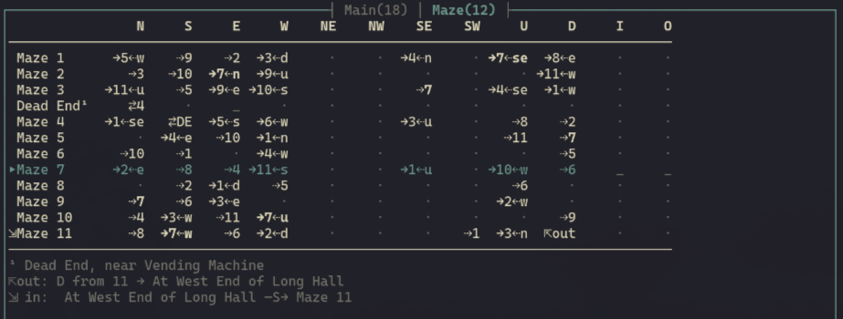

# Live automapping

[← back to README](../../README.md)

Play the game; the map draws itself. Every room you enter and every exit you take
is boxed, connected, and de-overlapped on the fly, then continuously nudged into a
clean layout — no graph paper, no pausing to annotate, no manual placement. Walk
north and a new room slides into place north of where you stood; double back and
the connection closes into a loop. This is babelmap's flagship feature, and it is
the reason the map pane earns half your terminal.

The mapper is deliberately **engine-agnostic**. It never sees a Z-machine opcode
or a Glk call — it consumes a plain stream of *locations* and *movements* and
turns it into a spatial graph. That means the **same automapper draws every
game**, whether you're charting the Great Underground Empire in *Zork*, threading
*Counterfeit Monkey* in Glulx, or exploring *Adventureland* in a classic Scott
Adams adventure. One map builder, three engines, zero special cases.


## Knowing where you are — across three engines

Before the mapper can place a room it has to be told which room you're in, and
each engine surfaces that differently. babelmap handles all of it, and records
*how* it worked out each room the first time it finds it — right-click a room to see
"Found by:" in the room dock's Diagnostics body. It is kept with the room, so the answer is
still there long after the turn that discovered it.

- **Classic Z-machine (v3)** reports the room in the status-line variable —
  `via status variable`.
- **v4/v5 Z-machine games that hide it** (Hitchhiker, Bureaucracy, A Mind
  Forever Voyaging) don't expose a room in the classic variable, so the room name
  is read off the status line and resolved back to a game object — preferring the
  player object's room when the game re-parents the player, Inform-style
  (`via player object`), and falling back to a name-only room otherwise
  (`via name match`, or `via name (unlinked)` when it can't be tied to an object).
  Games that **center** their room title in a custom status display (Beyond Zork,
  Trinity) are parsed too — the centered heading is accepted only once it
  validates against the player's room — so those now automap as well.
- **Graphical v6 Z-machine** (Zork Zero, Shogun, Arthur) has no status line at
  all: the bar is *painted* pixel by pixel wherever the game feels like putting
  it. babelmap finds it by asking where the prose window starts and reading the
  band directly above it — which is how Arthur works, since it hides its bar
  twelve rows down the screen, tucked under a full-width panel of artwork. The
  glyphs are laid back onto their columns first, because Arthur paints its bar one
  letter at a time; the room then goes through exactly the same checks as every
  other Z-machine game (`via player object`, or `via name match` when the game
  doesn't re-parent you, as Shogun doesn't). Some games never reserve the band at
  all and simply *overlay* the bar on the top row of a full-screen prose window
  (advent.z6): a short, full-width strip pinned to the top of the screen counts as
  the band even though nothing is "above" the prose. A title banner or a right-hand
  date field is never promoted to a room on a name match alone, and Journey — whose
  story window owns the top of the screen and whose menus sit below it — correctly
  reports no room at all (its menu window is the whole screen, not a strip).
- **Glulx (Inform 7)** games often keep the room out of the status bar entirely,
  so babelmap reads the **Inform room heading** — the bold title line printed as
  you enter a room (`via room heading`). Games like FooFoo and Superluminal
  Vagrant Twin map cleanly this way; rooms are matched by name since the Glulx
  world model isn't introspectable, and pre-game menus or character-setup screens
  correctly produce no room.
- **Scott Adams** adventures feed their locations straight through the same
  engine-agnostic pipeline — nothing special to configure.

## Getting around the map

The map is a place you can move through, not just a picture.

- **Zoom** — `zoom-map in|out|reset` (or a signed step) scales between a detailed
  boxed view and a compact overview.
- **Pan** — `pan-map <dx> <dy>` slides the viewport; `center-map` snaps back to the
  selected room, or the room you're standing in.
- **Layer tabs** — multi-level areas are split into named **layers** shown as a tab
  strip across the top of the map (e.g. `Main  Cellar  Maze`, each with its room
  count); the active tab is highlighted, and a layer flagged as a maze carries a
  trailing `⌗` marker (`Maze ⌗`) in both tab strips. `cycle-layer next|prev` switches
  between them. Carve a region off with `peel-layer` or fold one back with
  `merge-layer`. A bare `peel-layer` cuts at the passage you just walked in through —
  step into the maze, peel, and the maze goes to its own layer — which works even
  when the entrance is one-way or the way back is some other direction entirely.
  `peel-layer <direction>` names the seam yourself; with neither, it falls back to
  hunting for a stairway or other portal to cut at. A bare `merge-layer` folds the
  active layer into the one it was peeled from; `merge-layer <name>` folds it into
  **any** layer (`merge-layer main`). That second form is how a stranded room gets
  home: a room discovered while exploring a maze layer is minted *onto* the maze
  layer even when it is really outside — a back door to the surface, say — so stand
  in it, `peel-layer <direction>` to cut it off the maze, then `merge-layer main`.
  Rooms keep their positions where free; a room whose cell is taken lands on the
  nearest free one.
- **Switching layers recenters the view** — cycling, clicking a tab, peeling, merging,
  or loading a map all land the viewport somewhere with a room in it, never on empty
  scroll space: on the room you're standing in if it's on the layer you switched to,
  else the last room you visited there, else that layer's own bounding-box centre. A
  matrix layer selects the same room as its row and scrolls the table to show it.
- **View mode** — `view-map` (leader `u`) switches the active layer between the **drawn**
  map and the **matrix** — the direction table described below. Bare, it cycles; `view-map
  drawn` / `view-map matrix` sets it outright. The choice is per-layer and saved with the map,
  so a maze can stay a table while everything around it stays a map.
- **Room card** — the [room dock](interface.md#the-room-dock)'s Room body (`toggle-room-dock`,
  leader `k`, or left-click a room) lists **every** travel direction, not just the ones that go
  somewhere: where each leads, how it comes back, which you tried and found walled up (`×`), and
  which you have never tried at all (`·`). That is the map's answer to "where haven't I been?",
  one room at a time — and the dock follows you as you walk, so the card is about wherever you
  are standing unless you pin it to a room by clicking one. The twelve directions lay out in up
  to three columns (cardinals, diagonals, portals) when the dock is wide enough, so the card
  costs four rows rather than twelve.
- **Room diagnostics** — `toggle-inspector` flips the same dock to its Diagnostics body: the
  room's id, name, layer, position, and the per-edge layout constraints, so you can see *why* a
  room landed where it did.
- **Hand edits** — select rooms with `select-room next|prev`, `rename-room` /
  `rename-layer`, jot `edit-notes`, or clean up the graph with
  `delete-connection` and `relabel-edge`. Room-number labels toggle with
  `toggle-room-numbers`. Room *positions* are the layout engine's — re-run
  `tidy-map` rather than placing boxes by hand.
- **Export** — take the map with you: `export-svg` writes a scalable vector image,
  `export-dot` emits Graphviz DOT (render it with `dot -Tsvg …`), and `export-map`
  writes the raw structure. Omit the filename for a default path in the game's data
  directory. A saved map can be reopened later with `load-map`.

## Connections that stay readable

A naïve "one arrow per exit" map dissolves into spaghetti fast. babelmap routes
connections through a lane system with crossing-elimination and overlap removal,
and it understands the awkward cases:

- **Vertical connections** — up/down moves place the new room directly north (up)
  or south (down) of its neighbour, shoving ordinary rooms aside like a compass
  move but yielding to confirmed reciprocal N/S adjacencies. They render as dotted
  connectors with up/down (or stairs) glyphs — never as arrows, never as "distorted"
  red edges. A matching Up+Down pair between two rooms collapses to a single dotted
  path marked at both ends. Where a room pair is joined by *both* a compass direction
  and a staircase, only one line is drawn — see below for which wins.
- **Nautical directions** — ship games (Seastalker and kin) that steer by
  *fore / aft / port / starboard* (plus *bow* / *stern* / *forward*) instead of the
  compass are understood: those map onto north / south / west / east so the vessel's
  decks lay out correctly.
- **Combined multi-direction paths** — two rooms get **one** line between them, however
  many ways you can actually walk it. Zork's around-the-house ring links each pair by
  both a cardinal and a diagonal; Adventure's maze will happily connect the same two
  rooms four different ways, and a staircase often shadows a compass passage. Drawing
  them all means lines that exist only to cross each other, so babelmap picks a single
  representative: a **reciprocal** pairing first — the two ends are exact opposites, so
  the line runs straight and each arrowhead points the way you really travel — and
  otherwise by direction priority, **N, S, E, W, NE, NW, SE, SW, up, down**. The line
  that wins keeps its own arrowhead (or `↑`/`↓` if a staircase won), and each passage
  that lost stamps its **own glyph beside the shared line's anchor** — a staircase that
  lost to a compass edge shows its `↑` on the border of the room it climbs from, so a
  known way back never disappears into the collapse. Lines carrying more than one
  passage are also tinted with the `shared_path` selector — and the room dock's Diagnostics
  body lists every exit with its direction and destination, so nothing is lost, only
  unstacked.

Where two unrelated connectors still have to cross, the map says so rather than drawing a
junction: the vertical run passes through unbroken and the horizontal one breaks for a single
cell, so a crossing never reads as a place the two passages meet.

Confirmed reciprocal N/S and E/W adjacencies are treated as inviolable: an up/down
move yields rather than shove a reciprocal partner off its shared column or row, and
overlap cleanup may only slide a reciprocal room *along* its own axis, never off it.

## Keeping the layout tidy

The whole map re-optimizes itself as you discover rooms, so it stays readable as it
grows. How eagerly is up to you (`background_tidy`): after every new room (the
default), only when a new room overlaps an old one (`on_overlap`), debounced every
few rooms (`debounced`), or off entirely. Force a pass any time with `tidy-map`.

**Maze layers are left alone.** A layer flagged as a maze (below) is *frozen*: it
schedules no tidy, `tidy-map` on it answers "maze layer: geometry is frozen — the
matrix is the view", and its rooms keep the positions they were first given. There
is no compass arrangement of a maze to converge on — the layout engine would keep
producing a different wrong one every turn, and the pane would keep repainting for a
grid nobody is reading. Only the *optimization* stops: rooms, passages and tried
directions go on being recorded exactly as before, and a newly discovered room is
still placed where the move you walked says it should go, so unflagging the layer
(or switching it back to `view-map drawn`) shows a real map again.

Curious how a layout got built? `animate-tidy` steps through the whole assembly
stage by stage — a **Build** stop that lists every connection, then
**room-by-room placement** as each box drops onto the grid, then the
relayout/overlap-cleanup passes with each move described ("moved 180 to clear
overlap with 193"). Step it with `anim-step forward|back`, play/pause with
`anim-play`, and leave with `anim-exit`. It's equal parts diagnostic and quietly
mesmerising.

## Mazes: the matrix view



A compass map of a maze is a lie told carefully. In one real, half-explored
mapping of Colossal Cave's "all alike" maze — twelve rooms, forty-seven passages —
**two** passages come back the way you went. Eighteen come back by some other
direction, twenty-seven have no known return at all, and the layout engine has to
mark twenty-nine of the forty-seven "distorted" because no arrangement of boxes on
a grid can satisfy them. Eleven of the twelve rooms are called "Maze".

Compass geometry is not what a maze *is*. What you actually know in a maze is a
direction table per room: *west from here goes to that one, and the way back is
north*. So babelmap will draw you the table.

```
               N     S     E     W    NE    NW    SE    SW     U     D     I     O
──────────────────────────────────────────────────────────────────────────────────
 Maze 1     →5⇠w    ⇢9    ⇢2    ⇢3     ·     ·     ·     ·     ·     ·     ·     ·
 Maze 2       ⇢3   ⇢10  →7⇠n    ⇢9     ·     ·     ·     ·     · →11⇠w     ·     ·
 Maze 3    →11⇠u    ⇢5  →9⇠e →10⇠s     ·     ·     ·     ·    ⇢4     ·     ·     ·
 Dead End¹    ⇄4     ·     _     ·     ·     ·     ·     ·     ·     ·     ·     ·
 Maze 4       ⇢1   ⇄DE  →5⇠s  →6⇠w     ·     ·     ·     ·    ⇢8    ⇢2     ·     ·
 …
▸Maze 11      ⇢8  →7⇠w    ⇢6  →2⇠d     ·     ·     ·     ·  →3⇠n  ⇱out     ·     ·
──────────────────────────────────────────────────────────────────────────────────
¹ Dead End, near Vending Machine
⇱out: D from 11 → At West End of Long Hall
⇲ in:  At West End of Long Hall —S→ Maze 11
```

One row per room, one column per direction — **all twelve, always**. An untried
cell in any direction may be exactly the thing full exploration needs, so none are
hidden however empty the column looks.

| Cell   | Meaning |
|--------|---------|
| `⇄4`   | reciprocal — the compass inverse brings you back |
| `→5⇠w` | goes to 5, and **w**est is the way back (the row is self-contained) |
| `⇢9`   | one-way — no return known |
| `↩`    | self-loop — this direction leads back into this very room |
| `⇱out` | leaves the layer; the destination is footnoted below the table |
| `×`    | tried, and there is no path that way |
| `·`    | untried — the exploration frontier |

A move that got you *killed* leaves no `×` behind. Dying says nothing about whether
the passage is open, so the attempt is taken back and the cell stays `·`, still on
the frontier — including when the game asks whether to reincarnate you before it
admits the death, in which case the move that caused it is the one rolled back.

Nor does *getting up again* leave an edge. A death stays outstanding until the game
says how it ends, however many turns of "Please answer yes or no." that takes, and
the next room change on that side of it is read as the resurrection: the map follows
you to wherever you woke up and mints no passage, because wherever a game drops a
resurrected player is not a way out of the room you died in. Adventure's `yes` →
*"--- POOF!! ---"* → the well house is the case that named it. Exactly one such
relocation is swallowed: play resuming — a room description reprinted where you
stand, or the arrival itself — settles the death, and the next passage you walk maps
like any other.

**Reading it.** `▸` marks the room you are standing in. `⇲` marks a room a passage
from *outside* the layer leads into — a doorway into the maze, listed in a footnote
(`⇲ in:  <origin room> —<direction>→ <target>`) alongside where `⇱out` cells lead.
A room that is both here and a doorway shows `▸`: you are standing there, and the
entrance fact still reads in the footnote. Rooms sharing a display name are
numbered in the order you *found* them — "Maze 1" is whichever one you walked
into first, not whichever has the lowest id. That matters because the id is often
the story's own object number, which has nothing to do with when you found the
room: a number is minted the moment a room is first discovered and never changes
again, so finding a "new" duplicate that happens to have a lower id never
renumbers the ones you already know. Rows are in that same order, so a row's
position and its own number always agree. The numbering is otherwise
display-only — identity is still the room's own id — and it is stable across a
reload; a save from before this was tracked settles its numbers, once, to your
true visit order (each room's position in the save file), the first time it
reloads. Names too long for the label column are abbreviated and spelled out in a
footnote.

**Selection** moves with ↑/↓ (or Home/End, PageUp/PageDown) when the map pane has
focus, or by clicking a row. Clicking a *destination cell* jumps the selection to
that room's row. Selecting a room **bolds every cell elsewhere that arrives at it**
— its known entrances, which is the answer to "how do I get back here", and the one
question a row cannot answer about itself. That highlight is style, never a glyph:
the table's text does not change.

**Narrow panes** degrade before they scroll. First the `⇠x` return suffixes drop
(cells shrink to `→5`, and the return is still readable on the destination's own row
and in its room card); only when even that will not fit does the table scroll
sideways, with the label column pinned. The thresholds are computed from the table's
own contents — there is nothing to configure.

The matrix is also the one map view a screen reader can read: a table linearises
where a drawing cannot.

### Marking a maze

`mark-maze-layer` (leader `z`) flags the active layer as a maze. The flag moves the
layer's *default* view to the matrix; it never overrides a `view-map` you chose by
hand, and unflagging puts an unchosen layer straight back to drawn. On a
maze-flagged layer the last few rooms you walked through are also highlighted as a
fading breadcrumb (`map.trail`) — the "how did I get here" a drawn map would have
answered by itself. The flag also puts a `⌗` marker on the layer's tab (`Maze ⌗`) in
both tab strips, and takes it away again when unflagged.

babelmap will offer, once per layer, when a connected cluster starts to look like
one: at least six rooms, at least eight passages walked in *both* directions, and
three-quarters of those coming back by some direction other than the compass
inverse. That last measure is deliberately over round trips actually walked, not
over all edges — a passage nobody has walked back through yet says nothing about
geometry, only about how far exploration has got. (On the reference save the maze
scores 0.90 by that measure and the ordinary cave beside it 0.56; over *all* edges
the two are 0.96 and 0.82, which separates nothing.)

### Honest edges on the drawn map

The same asymmetry shows up outside mazes, so the drawn view stopped pretending
too, under one rule: **every arrow on a room border is that room's own exit** —
arrows are only ever outgoing. A two-way corridor wears each room's departure at
its own end; a **one-way** passage wears exactly one, at its origin, and the line
ending *bare* on the destination is the reading — you can get there, and nothing
known brings you back. One-way and
disagreeing-direction edges each have their own style selector (`map.edge:oneway`,
`map.edge:asym`), both defaulting to the ordinary connector so nothing changes
appearance until you choose to style it. A **self-loop** draws as a compact `↩w`
badge on the room box, never as a line looping out and back: a loop has no
geometry, and a drawn one would need its own lane to say less than three characters
do.

## Making it yours

Every glyph the map draws is a themeable preset in the `[map]` section of
`style.toml`, right alongside the map's colours — swap the whole look without
touching a line of code:

- `box_style` — room outlines: `rounded` (default), `thick`, `double`, `solid`,
  `super-thick`, `ascii`, or `borderless`.
- `arrow_set` — connector arrowheads: `filled` (default), `line`, or a family of
  Nerd Font sets (`nerdfont`, `nf-bold`, `nf-box`, `nf-circle`, `nf-outline`) for
  patched fonts.
- `path_style` — the line-art that draws the cardinal (N/S/E/W) connectors:
  `light` (default), `heavy`, or `dotted`.
- `portal_path_style` — the same three presets, applied on their own to the
  up/down/in/out portal links: `dotted` (default) keeps the familiar ┊/┄ threads.
- `portal_icons` — up/down/in/out markers: `ascii` (default), `nerdfont`, or
  `nerdfont-stairs` for distinct stairway icons.

The matrix view has its own selectors beside the map's colours:
`map.matrix.header`, `map.matrix.row:here`, `map.matrix.row:selected`,
`map.matrix.cell:entrance` (the bold cross-highlight), `map.matrix.cell:frontier`
(the dimmed `·`/`×` cells) and `map.matrix.footnote`; `map.trail` colours the
maze breadcrumb.

Individual glyphs can be overridden one at a time in `[map.overrides]`, and
`diagonal_corners = false` drops the half-diagonal corner stubs (🮠🮡🮢🮣, Unicode 13
Legacy Computing) in favour of plain orthogonal corner exits — the escape hatch
for a font that has no glyphs for them. Reload changes live with `reload-style`. See
[customization & configuration](customization.md) for the full styling surface, and
[interface](interface.md) for mouse-driven map navigation.
